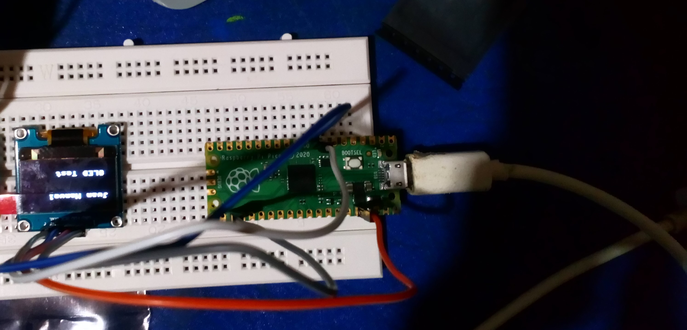
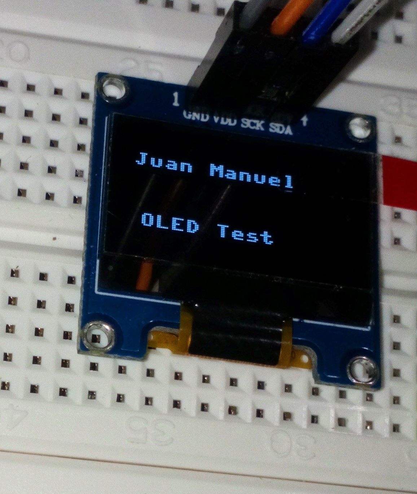

# SSD1603 OLED Screen

Testing out the Raspberry Pi Pico with the SSD1603 OLED Screen.

## Requirements

- [Thony](https://thonny.org).
- The [`ssd1306` python package](https://github.com/stlehmann/micropython-ssd1306).

## Result

## Additional resources

I follow the steps from this [YouTube video](https://youtu.be/SavAmyic_J4).